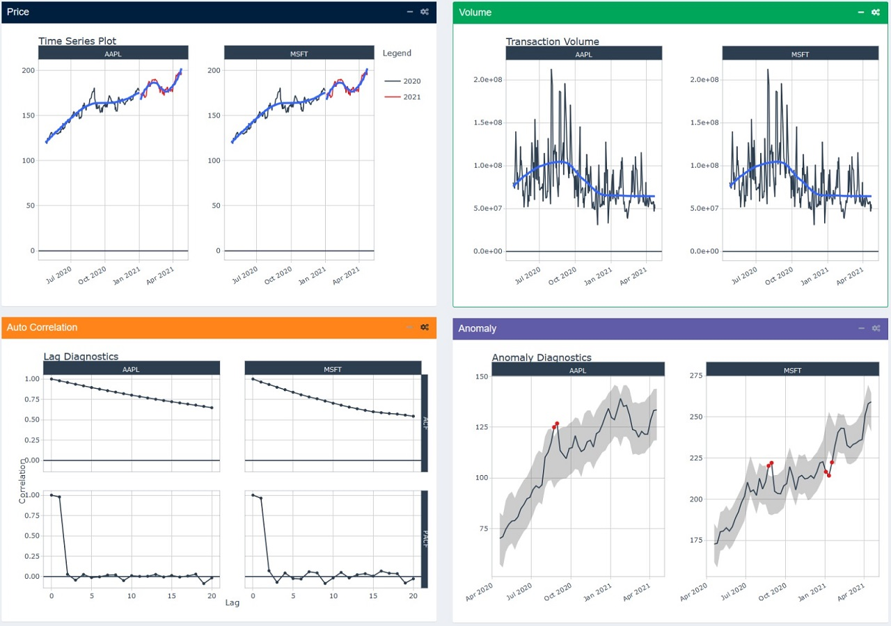
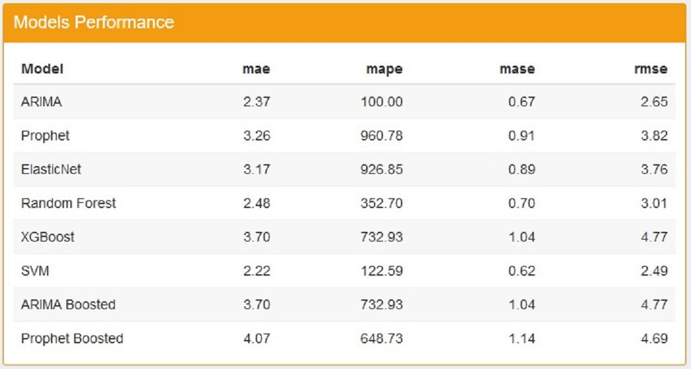

```{css, echo=FALSE}
.poster_wrap .main_bottom img{
height: 900;
}
main {text-align:center}
```

```{r setup, include=FALSE}
knitr::opts_chunk$set(echo = FALSE)
```

# Motivation 
Comparing the performance of many stocks can be time consuming, especially if you want to do it over and over again. With the help of R, Shiny and the availability of many open-source R packages, we developed a simple stock Analyzer- to do technical analysis and forecasting of a stock portfolio.   

```{r, echo=FALSE, out.width="100%", fig.align="center", fig.cap = "Three main modules"}
knitr::include_graphics("data/image1.jpg")
```

# Approach and Design Framework
Our project will explore and develop an app for this using
selected stocks from the US Stock Market.

`Exploration`: Exploratory Data Analysis explores the trends
of stock prices and transaction volumes using TIME SERIES
analysis. We select multiple stocks from different sectors and
compare them within the same selected time period.

`Technical Analysis`: Many investors analyze stocks based on their fundamentals such as their revenue, valuation, or
industry trends but fundamental factors aren't always reflected in the market price. Technical analysis using charts
help to identify trading signals and price patterns and provides as a window into market psychology to identify opportunities to profit. We built this with the core functions from TidyQuant[Ref.1] to support 
1.	Getting Financial Data from the web   
2.	Manipulating Financial Data  
3.	Performance Analysis and Portfolio analysis   

`Forecasting` : As a final feature, we build a forecasting flow for a stock incorporating a dashboard to train several ML models( up to 8 ) and the associated visualisation and performance matrix of the trained models, as well as the forecasts comparison for the stock. 

```{r, echo=FALSE, out.width="80%", fig.align="center", fig.cap = "Forecast process"}
knitr::include_graphics("data/forecastprocess.jfif")
```

# Key Output and Features

`EDA For Single Stocks and Portfolio of Stocks`

Exploratory Data Analysis implements a view of 4 equal sections, each showing a different types of chart.The charts can work with both single stocks, and portfolio of stocks.

```{r, echo=FALSE, out.width="100%", fig.align="center", fig.cap = "EDA Visualisation"}

```


`Technical Analysis for a Single Stock`:  

1. Price Movement Candlesticks Chart        
2. Stock Price and Trading Volume Line Charts/Bart Charts  
3. Bollingor Charts + Moving averages (15-day, 50-day) Chart
4. Monthly and Yearly Returns  

```{r, echo=FALSE, out.width="100%", fig.align="center", fig.cap = "Sample Visualisation for Single Stock"}
knitr::include_graphics("data/Bollingor.jpg")
```

`Technical Analysis for a Portfolio`:   

1. Closing prices  
2. Moving Average   
3. Bollinger Bands 
4. Portfolio Monthly/Yearly Returns  

```{r, echo=FALSE, out.width="100%", fig.align="center", fig.cap = "Sample Visualisation for Portfolio"}
knitr::include_graphics("data/Candlestickportfolio.jpg")
```
`Forecasting for A Single Stock`   

1. 8 ML (Machine Learning )models for forecasting  
2. Allow user to tweak the ML model parameters training and forecast parameters  
3. Visualisation of Forecast outcomes     
4. Output in a table of the performance of ML training and Forecast outcomes 

```{r, echo=FALSE, out.width="100%", fig.align="center", fig.cap = "Sample Visualization of Forecast Model Outcomes"}
knitr::include_graphics("data/MultipleStocksForecast.jpg")
```

```{r, echo=FALSE, out.width="100%", fig.align="center", fig.cap = "Sample Visulisation Model Performance"}

```

# Learnings and Future Work

One of the most difficult challenge of building this application is designing the layout of all the components of a module. The application needs to find the right balance between showing too many visualizations, which can overwhelmed the users, and showing too little, which can make it harder to draw out meaningful insights. 

To tackle this challenge, the use of more advanced Bootstrap features is needed, which allows the hiding and showing of different components, thus the users themselves can decide how many visualizations is suitable for them. The packages that enables these Bootstrap features are `shinydashboard` and `shinydashboardplus`.In implementing technical analysis, it was discovered that some tidy packages,lacked integration with `plotly` R package, which meant that interactivity was not possible with the chart. While convenient, there are some limitations to the `timetk` and `modeltime` packages, which can result in difficulties when trying to configure smaller details of the visualizations. In some cases, it might be better to `modeltime` purely for processing and training data purposes and plot the trained data from scratch using `ggplot2` in order to get the desired visualization


# Conclusion

In conclusion,leveraging the recenlty available R packages that have specialised/built in technical functions for Financial Analysis and Shiny, we can provide to the investor a easy interface to perform stock evaluation and analysis.

# References
1.TidyQuant Project Website https://business-science.github.io/tidyquant/  
2.Hyndman,R.J.,& Athanasopoulos,G(2021)Forecasting: principles and practice,3rd edition


