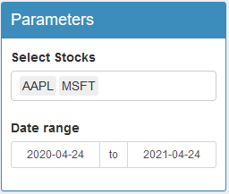
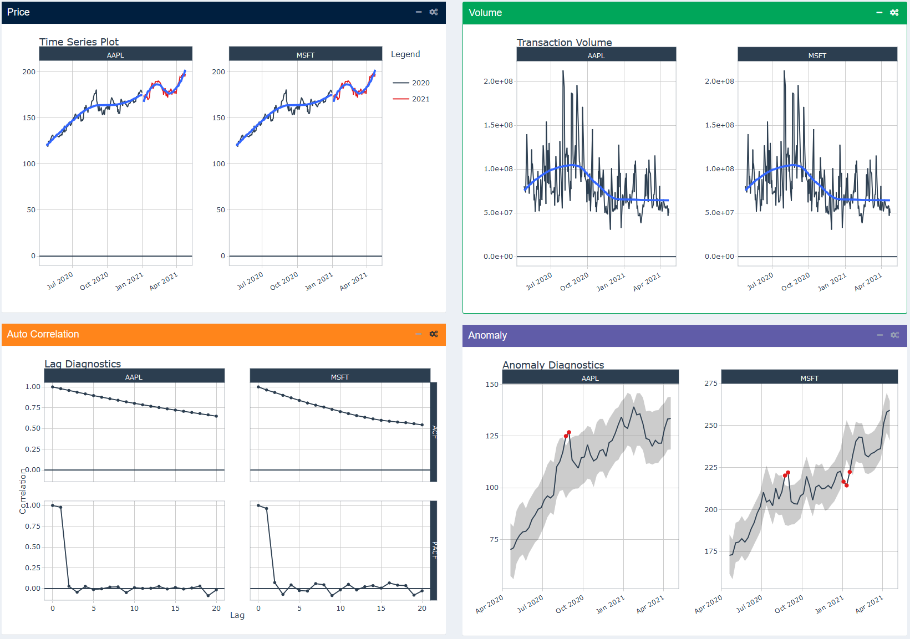
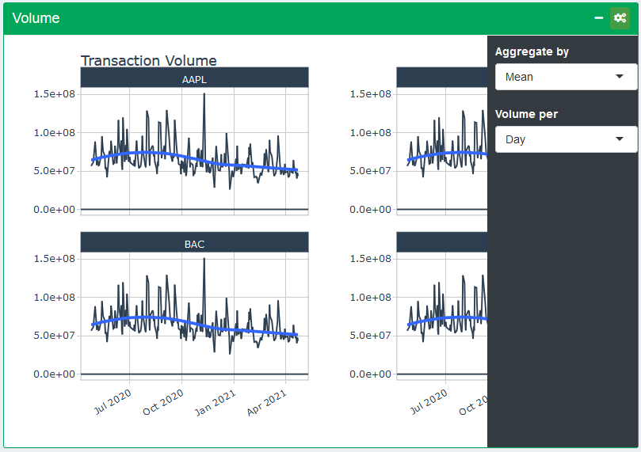
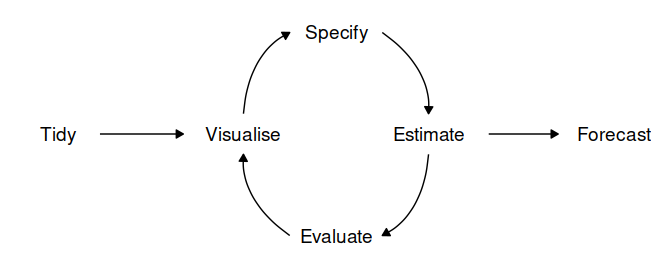

# Introduction 
Comparing the performance of many stocks in a single visualization can be time consuming, especially if you want to do it over and over again. With the help of R, Shiny and the availability many open source R packaged, you can easily create and track a stock portfolio to see how individual stocks perform over time. For a beginner investor there will at least three group of functions he will need


Our project will explore and develop an app for this using selected stocks from the US Stock Market.

**Exploration**: Exploratory Data Analysis explores the trends of stock prices and transaction volumes using TIME SERIES analysis. We select multiple stocks from different sectors and compare them within the same selected time period. 

**Technical Analysis**: Many investors analyze stocks based on their fundamentals such as their revenue, valuation, or industry trends but fundamental factors aren’t always reflected in the market price. Technical analysis using charts help to identify trading signals and price patterns and provides as a window into market psychology to identify opportunities to profit.

**Forecasting**: As a final feature, we build a forecasting flow for a stock incorporating a dashboard to train several machine learning models and the associated visualization and performance matrix of the trained models, as well as the forecasts comparison for the stock. 

# Design Framework

The application was designed with the goal to provide beginner users with all the necessary tools to perform the most common stock analysis techniques. Further more, the application aims to give users as much freedom as possible to customize the charts and analytical models, which can be achieved by making the charts highly interactive with the assistance of parameters that the user can tweak. Another goal of the application is make it stock-agnostic, which means the users should be able to query for any stock symbol that is available through Yahoo Finance, and not limited to the pre-defined stock symbols. The application consists of three sub-modules: Exploratory Data Analysis, Technical Analysis and Forecast, each with their own type of charts for different types of analysis.

With the extensive capabilities provided by R and R Shiny, all of these objectives of the application can be easily implemented into a web application which can take in user inputs and output the required visualizations. The general user interface design of the application will follow a layout of having the tunable parameters on the side of desktop, while the main plot, or sub-plots in the case of faceted views, will be displayed on the majority of the screen. Since the UI of Shiny is based on Bootstrap, the application can also utilize Boostrap features for web design such as accordion or collapsible panels to give users the option to hide or show certain section of the visualization, which can help in optimizing the screen real estates.

## Exploratory Data Analysis
Following the guidelines of the design framework, the EDA module of the application has the basic parameters on the left side. This parameters section of the EDA module contains a standard date range selection, which will enables user to filter the stocks to certain range. The other parameter in this section is a stock symbol selection, which lets the users choose up to 4 stock symbols from a list of 8 pre-defined stock symbols. Should the user wants to query for other symbols from Yahoo Finance, they can do so by adding additional values into the dropdown list and select the new values; this is possible thanks to the selectize UI input element of R Shiny.

```{r, echo=FALSE, out.width="40%", fig.align="center"}

```


Since users doing Exploratory Data Analysis may require the viewing of different types of chart at the same time, the main display area of the module is split into 4 equal sections, each showing a different types of chart. In all the section, the layout of the charts and sub-charts is dependent on the selected stock symbols. If only one symbol is selected, then each section will show only one chart. However, if multiple stock symbol is selected, the sections will show a faceted layout containing multiple sub-plots, one per stock symbol.



Aside from the shared parameters on the left panel, each chart types in the EDA module also has their own parameters that is accessible clicking on the cog icon at the top right of each chart section, which will open up a side bar menu containing parameters that are applicable to only their specific chart.



- **Price Chart**: This section is the most basic chart of the application, showing an interactive line plot with a trend line of the selected stocks over the selected time range. The price chart specific parameters includes a *Price at* parameter for the selection of which column of the stock's historical data to be visualized. The other parameter allows the user to aggregate the data by a certain time period: day, week or month. The summary function used for the aggregation is defaulted to the mean price of the stock since it is not logical to take a sum of price.
- **Volume Chart**: The volume chart section has a *Volume per* parameter, which is similar to the *Price per* parameter of the price chart where by the user can aggregate the volume data to specific time period. Changing the *Aggregate by* parameter will change the aggregation function of the chart to either sum or arithmetic mean.
- **Auto Correlation Chart**: The auto correlation and partial auto correlation charts show the correlation of each stock symbol with its own past price. In this sub menu of this section, the user can configure which price column to be used to plot the chart and how many days of lag should be evaluated.
- **Anomaly Detection Chart**: the anomaly detection section displays an interactive chart to visualize anomalies in historical stock data, with parameters similar to previous section in which the data column for evaluation can be selected and the data can also be aggregated to a time range.

## Technical Analysis

### Why Technical Analysis

Many investors analyze stocks and their stock portfolios based on their fundamentals such as their revenue, valuation, or industry trends but fundamental factors aren’t always reflected in the market price. Technical analysis using charts help to identify trading signals and price patterns and provides as a window into market psychology to identify opportunities to profit. 

### Why Visualization

Visualizing stock performance/technical indicators for both single stock and portfolio allow quick analysis, but are now available only on paid portals, or are tedious to generate for the everyday investor.

### Gaps in Existing R packages

Provided an open-source way to develop such tools, but existing solutions for quantitative analysis functions have the following gaps: lack of a few key functions including integration into the R tidy-verse workflow, APIs for loading of stock data, readymade callable functions for technical analysis, portfolio views, and data wrangling.

### Basic Technical Stock Analyze

**How it is built**

This is built with the core functions from TidyQuant[@tidyquant]. This includes:

a. Getting Financial Data from the web: 
tq_get().- a one-stop shop for getting web-based financial data in a “tidy” data frame format. We can get data for daily stock prices (historical), key statistics (real-time), key ratios (historical), financial statements, dividends etc. 
b. Manipulating Financial Data: 
tq_transmute() and tq_mutate(). Integration for many financial functions from xts, zoo, quantmod, TTR and PerformanceAnalytics packages. tq_mutate() is used to add a column to the data frame, and tq_transmute() is used to return a new data frame which is necessary for periodicity changes. 
c. Performance Analysis and Portfolio analysis: 
    - tq_performance()
    - tq_portfolio().

**Summary Functions** 

For Single Stock:

a. **Price Movement** Candlesticks Chart: This chart reflect the impact of investor sentiment on security prices and are used by technical analysts to determine when to enter and exit trades. 
b. **Stock Price and Trading Volume** Line Charts/Bart Charts: This chart provide the the volumes have been in the past and what they are currently before making a decision. 
c. **Moving averages (15-day, 50-day)** Chart :provides stock price movement providing moving average especially good for indicating volatility of stocks.
d. **Monthly and Yearly Returns** provide a view to the investor, what kind of returns he might have expected from a chosen stock over a longer period of time.

For Portfolio :

a. **Closing prices** - All stock prices in one chart
b. **Moving Average** - All stocks performance provided side by side in a facet view to facilitate comparison
c. **Bollinger Bands** - All stocks performance provided side by side in a facet view to facilitate comparison
d. **Portfolio Monthly Returns** - Simulate the performance of a group of stocks based on selected ‘weights’ in each of the portfolio
e. **Portfolio Yearly Returns** - Simulate the performance of a group of stocks based on selected ‘weights’ in each of the portfolio

**Sample Visualizations**

\begin{figure}[h]
  \includegraphics{ta_chart.png}
  \caption{Technical Analysis for Single Stock - Bollinger Bands overlay with Candlesticks of Stock Prices}
\end{figure}

\begin{figure}[h]
  \includegraphics{pa_chart.png}
  \caption{Technical Analysis for Portfolio: Candle Sticks Chart for Portfolio of Stocks in Facet View for comparison}
\end{figure}

## Forecast
The visual analytics application needs to provide users with all the tools required to do time series forecasting. Let's take a look at the standard process of producing forecasts for time series data and see how SSA can assist in each step of the workflow[@forecast].



- **Data preparation (tidy)**: Before any time series forecasting can be done, the core requirement that needs to be satisfied is getting historical data. After which the data must be prepared to get the correct format. Luckily, since the focus of the application is on stock analysis and forecasting, the retrieval of stock's historical data can be easily done with the use of the `tidyquant` package. No pre-processing is needed as the data will already be in a cleaned format.
- **Plot the data (visualize)**: Once data are collected and processed, the next essential step in understanding the data is Visualization. By visually examining the data, we can spot common patterns and trends, which will in turn help us specify an appropriate model. This step of the workflow is already handled by the Explore module of the Shiny application through the use the `timetk` package[@timetk].
- **Define a model (specify)**: There are many different time series models that can be used for forecasting. Choosing an appropriate model for the data is essential for producing appropriate forecasts. It is generally a good idea to try out and compare a few different models before specifying a certain model for forecasting. For SSA, one of the objectives of this Forecast module is let the users evaluate many models in a quick and efficient way, hence a total of 8 models with a mixture of both traditional forecasting models and machine learning forecasting models have been selected and made available in the Forecast module.
- **Train the model (estimate)**: Models will have to be fitted into the time series before it can carry out any forecasting. The process usually involves one or more parameters which must be estimated using the known historical data. The parameters often differs between models and packages so in most cases when using R, tuning the parameters would require the forecaster to both possess adequate skills in R and understand the syntax of each model. By providing an user interface to calibrate the models, BSA allows users of any technical skill levels to experiment and test the forecasting models.
- **Check model performance (evaluate)**: The performance of the model can only be properly evaluated after the data for the forecast period have become available. A number of metrics have been developed to help in assessing the accuracy of forecasts and they will be available through an accuracy table.
- **Produce forecasts (forecast)**: Once a model has been trained, evaluated and calibrated, the next step for the forecaster is to refit the models with the entire data and forecast it forward. The Forecast module will perform this step at the same time the training step, hence users can get the forecasted values with just a single click.


To start off, the design of the Forecast module also includes a parameter section of the left side of the display.Since forecasting can only be done on one time series, the stock selection here only allows users to choose one stock symbol, however, users are able to query to stock symbols which are not in the pre-defined in the dropdown by adding a new entry. As with any machine learning models, in order to evaluate the performance, a part of the data has to be split off and reserved for validating purposes; the *Training - Validation Split* parameter will let users decide this split. The next parameter in this section is the *Forecast Horizon* for configuring how many days in the future should the models forecast.

Below the horizon setting is the parameter to choose what kind of date features should be fed into the forecasting models. With the `modeltime`[@modeltime] models, the date values can be consumed as is, however, machine learning models from the `tidymodels` package requires the date values to be converted to date derivatives (e.g week number, June to 6, etc.) or in some cases, perform Fourier Transformation to extract new date features while conserving the cyclic nature of date e.g. after the 30th or 31st date of the month, it's back to the 1st date. This parameter would allow the users to choose the either types or date features extraction, or both. The last parameter for data preprocessing is the *Differecing Lag* slider input. It lets users stationarize the stock data by performing differencing on it with a chosen number of days of lag. Setting this slider to 0 will perform no differencing i.e. the stock data will remain as is.

Unlike the previous modules, the Forecast module requires some computational time to  train the models and forecast, thus it cannot be as reactive and requires users to click on the *Train and Forecast* button to trigger all the actions and update the charts.

Under the *Data Preprocessing* section is the *Parameters Tuning* section, which is hidden by default but will show the parameters once clicked on, meanwhile the preprocessing section will be collapsed to save screen real estates. This section is where users can calibrate individual models by selecting the model they want to calibrate in the top dropdown list to show all the available parameters for that selected model. The available models and their parameters are:


1. ARIMA:
    - Order of auto-regressive (AR)
    - Order of integration for differencing
    - Order of moving average (MA)
2. Prophet:
    - Number of potential changepoints
    - Changepoints range
3. ElasticNet
    - Penalty
    - Mixture
4. RandomForest:
    - Number of trees
    - Minimum data points
5. XGBoost:
    - Number of trees
    - Minimum data points
    - Tree depth
6. SVM RBF:
    - Cost
    - Margin
7. ARIMA Boosted:
    - Order of auto-regressive (AR)
    - Order of integration for differencing
    - Order of moving average (MA)
    - Number of trees
    - Minimum data points
    - Tree depth
8. Prophet Boosted:
    - Number of potential changepoints
    - Changepoints range
    - Number of trees
    - Minimum data points
    - Tree depth
    
The main display of the Forecast module consists of 3 components: the Individual Models, Multiple Models and Models Performance section.


The individual models are where the line charts for the models are faceted into a grid of 2 columns and the section itself contains 3 tabs: Validation, Forecast and Residuals; with each tab showing a different type of line charts. The Validation tab shows the Forecast Validation plot for the selected stock symbol. This type of visualization lets the users compare the forecasted pattern of each model with the actual data. A confidence interval band is also drawn on each chart for further evaluation. The second tab, the Forecast tab also displays forecasted patterns per model, however, for this tab the models have been refitted with the entire stock data and forecasted for the next certain number of days, depending on how many days was set in the horizon parameter. The last tab, Residuals can be used to examine the forecasting residuals of each model.


The Multiple Models section has the same contents as the previous section, with the difference being that the charts are no longer faceted but combined into a single chart for easier comparison between models. The confidence interval bands have also been removed for better visibility of the lines.


The last section, Models Performance is to display an accuracy table for evaluation of each model's performance. The table is interactive, allowing for sorting by different metrics. The metrics available are: Mean Absolute Error (MAE), Mean Absolute Percentage Error (MAPE), Mean Absolute Scaled Error (MASE) and Root Mean Squared Error (RMSE).

# Use Case

As our application provides a novice investor the ability to perform analysis of stocks and portfolio beyond trading just on market news, and simple indicators such as price and volume trend.

One likely user of this is a novice investor such as fresh graduates/young working adults who plan to invest their extra income in the stock market.

These students may have basic finance and investment knowledge, but no programming skills to automate the analysis of all this informaiton. By putting visualizations & forecasting tools in their hands they will be able to:

1. Quickly Visualize and understand past performance
2. Simulate their own investment decisions and scenarios, and checking against the apps forecast
3. Analyze which categories of stocks provide longer term gains or are more volatile
4. Understand the effect of mixing different type of stocks in their portfolio.

Even if the young investor does not act on buying or selling stock with the information form the app, the app can help them validate their own simulated stock trading ‘decisions’. As they become more sophisticated investors and with larger budget, they will likely need more advance tools, but this simple app with get their investment journey going.

# Evaluation & Discussion

One of the most difficult challenge of building this application is designing the layout of all the components of a module. The application needs to find the right balance between showing too many visualizations, which can overwhelmed the users, and showing too little, which can make it harder to draw out meaningful insights. To tackle this challenge, the use of more advanced Bootstrap features is needed, which allows the hiding and showing of different components, thus the users themselves can decide how many visualizations is suitable for them. The packages that enables these Bootstrap features are `shinydashboard` and `shinydashboardplus`.

In implementing technical analysis with the R `tidyquant` package, it was discovered that it lacked integration with `plotly` R package, which meant that interactivity was not possible with the chart. The `tidyquant` package has many advance technical functions which are not really suitable for use by the beginner investor as they require more technical knowledge. At the same time, some technical indicators could not be visualize in charts but only tables, that are not easy to interpret.

While convenient, there are some limitations to the `timetk` and `modeltime` packages, which can result in difficulties when trying to configure smaller details of the visualizations. In some cases, it might be better to `modeltime` purely for processing and training data purposes and plot the trained data from scratch using `ggplot2` in order to get the desired visualization.

# Future work

Given more time the following can be implemented in a future upgrade more of the `tidyquant` technical functions can be implemented, and also a version of the application for the Advance investor can also be built. The User interface of the Technical Analysis module can also be improved by allowing the users to input their own choice of stocks.

To improve the forecasting functionality of the application, there are some potential features that can be added, such as additional models and exposing more parameters to the user, allowing for finer tuning of the models parameters. An ensemble feature which lets users choose which of the trained model to be added to an ensemble model and how much should each model weights will provide a powerful functionality for users to achieve the desired result.

# Conclusion
Leveraging advance open source R packages (including specialized ones that support Stock/Finance analysis such as `modeltime`, `timetk`, `tidyquant`) allows the beginner and also the advance investors, to explore single stock and portfolio performance of stocks, make technical analysis and also forecast the behavior of their stocks and portfolio. By leveraging R and particularly R SHINY, we make available to many investors, who have no coding experience, the ability to easily to do advance analysis by providing a easy to use interface to tweak the model parameters for analysis and forecast, advance deep dive, and comparisons by providing multiple views and interactivities.


# References

---
references:
- id: tidyquant
  title: "tidyquant - Bringing financial and business analysis to the tidyverse"
  URL: "https://business-science.github.io/tidyquant/"
- id: forecast
  title: "Forecasting: principles and practice, 3rd edition"
  author: 
  - family: Hyndman
    given: R.J.
  type: book
  publisher: OTexts
  URL: 'https://OTexts.com/fpp3'
  issued:
    year: 2021
- id: fenner2012a
  title: One-click science marketing
  author:
  - family: Fenner
    given: Martin
  container-title: Nature Materials
  volume: 11
  URL: 'https://doi.org/10.1038/nmat3283'
  DOI: 10.1038/nmat3283
  issue: 4
  publisher: Nature Publishing Group
  page: 261-263
  type: article-journal
  issued:
    year: 2012
    month: 3
- id: modeltime
  title: "modeltime - Tidy time series forecasting with tidymodels"
  URL: "https://business-science.github.io/modeltime/index.html"
- id: timetk
  title: "timetk: A Tool Kit for Working with Time Series in R"
  URL: "https://business-science.github.io/timetk/"
...

