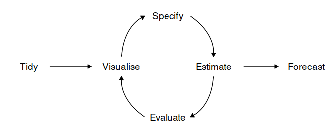

```{r setup, include=FALSE}
knitr::opts_chunk$set(echo = TRUE)
```

*This report details the exploration of `modeltime`*

## A Forecasting Workflow
The process of producing forecasts for time series data in general can be broken down into a few steps.

```{r, echo=F, out.width = "100%"}

```

- **Data preparation (tidy)**: Before any time series forecasting can be done, the core requirement that needs to be satisfied is getting historical data. After which the data must be prepared to get the correct format. Lucky for us, since the focus of our application is on stock analysis and forecasting, the retrieval of stock's historical data can be easily done with the use of packges such as `tidyquant` or `quantmod`. No pre-processing is needed as the data will already be in a cleaned format.
- **Plot the data (visualize)**: Once data are collected and processed, the next essential step in understanding the data is Visualization. By visually examining the data, we can spot common patterns and trends, which will in turn help us specify an appropriate model. This step of the workflow will be handled by the Explorer module of our Shiny application through the use the `timetk` package.
- **Define a model (specify)**: There are many different time series models that can be used for forecasting. Choosing an appropriate model for the data is essential for producing appropriate forecasts. It is generally a good idea to try out and compare a few different models before specifying a certain model for forecasting. Traditional time series forecasting models such as ARIMA, Exponential smoothing state space model (ETS) and Time series linear model (TSLM) are available through the `forecast` package, which has now been deprecated and replaced by the `fable` package. Machine learning models can deployed using the `tidymodels` framework with its' machine learning focused packages and toolkit.
- **Train the model (estimate)**: Models will have to be fitted into the time series before it can carry out any forecasting. The process usually involves one or more parameters which must be estimated using the known historical data. The parameters often differs between models and packages, requiring the forecaster to understand the syntax of each model to perform the modeling.
- **Check model performance (evaluate)**: The performance of the model can only be properly evaluated after the data for the forecast period have become available. A number of methods have been developed to help in assessing the accuracy of forecasts
- **Produce forecasts (forecast)**: Once a model has been evaluated and selected as the best model with its parameters estimated, the model should then be refitted with the entire data being forecasted forward.

#### A Visual Analytics Application
- The *Visualize*, *Specify*, *Estimate* and *Evaluate* steps form an iterative process which requires the forecaster to perform repeated cycles of calculated trial and error in order to achieve a good result. The Shiny Visual Analytics Application (VAA) will utilize graphs to explore the data, analyze the validity of the models fitted and present the forecasting results. By providing the user with an interface to tune and visualize models, the application will enable forecasters to easily experiment with different algorithms without the need to write codes and scripts.
- 

#### Benefits of `modeltime`
- Integrate closely with the `tidyverse` collection of packages, particularly `modeltime` lets user taps into the machine learning ecosystem of `tidymodels`, particularly the `parsnip` models.
- Evaluation, combining multiple models
- Use 
- easily create a plethora of forecasting models by combining modeltime and parsnip
- Hybrid models 

## Time series forecasting with Modeltime

#### Loading the packages
- `tidyverse`
- `lubridate`
- `timetk`
- `modeltime`
- `tidymodels`

```{r message=FALSE, warning=FALSE}
packages <- c('tidyverse', 'lubridate', 'timetk', 'modeltime', 'tidymodels', 'tidyquant', 'glmnet', 'randomForest', 'earth')

for (p in packages){
  if (!require(p,character.only = T)){
    install.packages(p)
  }
  library(p,character.only = T)
}
```

#### Loading the data

The objective is to make the application stock agnostic, meaning we can use the application with any stock and not just any specific ticker. For the purpose of this report, we will be using Apple's stock (AAPL)

```{r}
stock <- tq_get("AAPL", get = "stock.prices", from = " 2020-01-01")
```

We're only interested in the closing price from the start of this year, 2021

Data preprocessing, including doing differencing on the data to remove the trends and the time series data

```{r}
stock_tbl <- stock %>%
  select(date, close) %>%
  filter(date >= "2021/01/01") %>%
  set_names(c("date", "value")) %>%
  mutate(value = diff_vec(value)) %>%
  mutate(value = replace_na(value, 0))
  
stock_tbl
```

Plotting the stock's historical data

```{r}
stock_tbl %>%
  plot_time_series(date, value, .interactive = TRUE)
```

Split the data, using the data from the last 3 weeks as validation data

```{r}
splits <- stock_tbl %>%
  time_series_split(assess = "3 weeks", cumulative = TRUE)

splits %>%
  tk_time_series_cv_plan() %>%
  plot_time_series_cv_plan(date, value, .interactive = TRUE)
```

Since the date column is meaningless to the machine learning models, some features engineering are required to convert the data format. THis can be done using the `step_timeseries_signature` from `modeltime`, which returns a `recipe` object. With it, we can perform additional `recipe` functions such as Removing unused columns and creating dummy variables for categorical features

Parsnip models need to convert Date column to ID

```{r message=FALSE, warning=FALSE}
recipe_spec <- recipe(value ~ date, training(splits)) %>%
  step_timeseries_signature(date) %>%
  step_rm(contains("am.pm"), contains("hour"), contains("minute"),
          contains("second"), contains("xts"), contains("half"),
          contains(".iso")) %>%
  #step_mutate(value = replace_na(value, 0)) %>%
  step_normalize(date_index.num) %>%
  #step_fourier(date, period = 365, K = 5) %>%
  step_dummy(all_nominal())
  
recipe_spec_parsnip <- recipe_spec %>%
  update_role(date, new_role = "ID")

bake(recipe_spec %>% prep(), new_data = NULL)
```

Creating and fit an ARIMA model using `modeltime`

```{r message=FALSE, warning=FALSE}
model_fit_arima <- arima_reg() %>%
  set_engine("auto_arima") %>%
  fit(value ~ date, training(splits))

model_fit_arima
```

Similarly, we use `modeltime` to create and train a Prophet model

```{r}
workflow_fit_prophet <- workflow() %>%
  add_model(
    prophet_reg() %>% set_engine("prophet")
  ) %>%
  add_recipe(recipe_spec) %>%
  fit(training(splits))

workflow_fit_prophet
```

Using the new features, we can start creating and training machine learning models, starting with linear regression model. Setting the `mixture` variable will allow us to configure the model to be Ridge, Lasso or ElasticNet. Here, we'll use ElasticNet for our experiment.

```{r}
model_spec_glmnet <- linear_reg(penalty = 0.01, mixture = 0.5) %>%
  set_engine("glmnet")

workflow_fit_glmnet <- workflow() %>%
  add_model(model_spec_glmnet) %>%
  add_recipe(recipe_spec_parsnip) %>%
  fit(training(splits))
```


A random forest model can be setup similarly to the linear regression model. <Parameters>

```{r}
model_spec_rf <- rand_forest(trees = 500, min_n = 50) %>%
  set_engine("randomForest")

workflow_fit_rf <- workflow() %>%
  add_model(model_spec_rf) %>%
  add_recipe(recipe_spec_parsnip) %>%
  fit(training(splits))
```

Model for XGBoost

```{r}
workflow_fit_xgboost <- workflow() %>%
  add_model(
    boost_tree() %>% set_engine("xgboost")
  ) %>%
  add_recipe(recipe_spec_parsnip) %>%
  fit(training(splits))

workflow_fit_xgboost
```

The last machine learning model to be tested is SVM

```{r}
model_spec_svm <- svm_rbf() %>% 
  set_engine("kernlab") %>% 
  set_mode("regression") %>%
  translate()
  
workflow_fit_svm <- workflow() %>%
  add_model(
    svm_rbf() %>% 
    set_engine("kernlab") %>%
    set_mode("regression")
  ) %>%
  add_recipe(recipe_spec_parsnip) %>%
  fit(training(splits))
```

Boosted ARIMA model

```{r message=FALSE, warning=FALSE}
workflow_fit_arima_boosted <- workflow() %>%
  add_model(
    arima_boost(min_n = 2, learn_rate = 0.015) %>%
    set_engine(engine = "auto_arima_xgboost")
  ) %>%
  add_recipe(recipe_spec) %>%
  fit(training(splits))
```

A hybrid model of Prophet and XGBoost is also supported by `modeltime`

```{r}
model_spec_prophet_boost <- prophet_boost(seasonality_weekly = FALSE,
                                          seasonality_daily =  FALSE,
                                          seasonality_yearly = FALSE) %>%
  set_engine("prophet_xgboost") 

workflow_fit_prophet_boost <- workflow() %>%
  add_model(model_spec_prophet_boost) %>%
  add_recipe(recipe_spec) %>%
  fit(training(splits))

workflow_fit_prophet_boost
```

Once all the models have been fitted, they will be added into a Model Table using `modeltime_table` for an easy way to visualize and evaluate the performance of the models as well as do forecasting on all models at once.

```{r}
model_table <- modeltime_table(
  model_fit_arima,
  workflow_fit_arima_boosted,
  workflow_fit_prophet,
  workflow_fit_prophet_boost,
  #model_fit_ets,
  workflow_fit_glmnet,
  workflow_fit_rf,
  workflow_fit_svm,
  workflow_fit_xgboost
) 

model_table
```

```{r message=FALSE, warning=FALSE}
calibration_table <- model_table %>%
  modeltime_calibrate(testing(splits))

calibration_table
```

```{r message=FALSE, warning=FALSE}
calibration_table %>%
  modeltime_forecast(actual_data = stock_tbl) %>%
  plot_modeltime_forecast(.interactive = TRUE)
```

```{r message=FALSE, warning=FALSE}
calibration_table %>%
  modeltime_accuracy() %>%
  table_modeltime_accuracy(.interactive = FALSE)
```

Refit and Forecast Forward

```{r message=FALSE, warning=FALSE}
calibration_table %>%
  modeltime_refit(stock_tbl) %>%
  modeltime_forecast(h = "2 weeks", actual_data = stock_tbl) %>%
  plot_modeltime_forecast(.interactive = TRUE)
```

## Dashboard design

## Reference
- Hyndman, R.J., & Athanasopoulos, G. (2021) Forecasting: principles and practice, 3rd edition, OTexts: Melbourne, Australia. OTexts.com/fpp3. Accessed on April 7th 2021.

