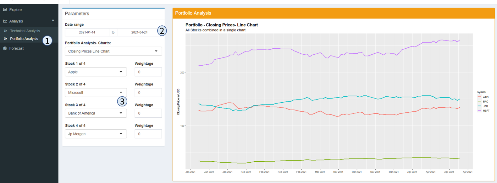

```{r setup, include=FALSE}
knitr::opts_chunk$set(echo = TRUE)
```

# Explore

```{r, echo=FALSE, out.width="100%", fig.align="center"}
knitr::include_graphics("images/explore_guide1.png")
```

1. Start by selecting up to 4 stock symbols from the pre-defined list of the `Select Stocks` field. It's possible to query stock symbols which are not in the list by typing into the field and add the value. If the stock symbol cannot be found on Yahoo Finance, the application will ignore this value

```{r, echo=FALSE, out.width="40%", fig.align="center"}
knitr::include_graphics("images/explore_guide2.png")
```

2. Select a date range of the stocks' historical data to be explored using the `Date Range` parameter.
3. The visualization of the Explore module is divided in 4 sections, each displaying a different type of chart: Price, Volume, Auto Correlation and Anomaly.

```{r, echo=FALSE, out.width="100%", fig.align="center"}
knitr::include_graphics("images/explore_guide4.png")
```

4. At the top corner of each section, there is an icon to collapse the section so user can choose to hide the charts they don't want to see.
5. To configure each chart type, click on the cog icon at the top right corner of the chart's section to display the sub-menu, which contains all the parameters corresponding to that particular chart type.

```{r, echo=FALSE, out.width="100%", fig.align="center"}
knitr::include_graphics("images/explore_guide3.png")
```

# Analysis

## Technical Analysis
Use this Tab to do basic Technical Analysis of your single stock

```{r, echo=FALSE, out.width="100%", fig.align="center"}
knitr::include_graphics("images/ta_guide1.png")
```

1. Click the Tab –<Analysis > - and select the tab <Technical Analysis>
2. Select the Start and End Date for the analysis of your single stock.
3. Select the type of chart you want to view by clicking the drop down menu. The available options are:
    a. Basic – Closing Price  - which will show the closing prices 
    b. Basic -  Closing – which will show the volume by day
    c. Returns – Monthly – which will show the bar chart of monthly returns and a trend line overlayed on the bar chart
    d. Returns – Yearly – which will show the yearly return for the stock since 2012
    e. Candlestick Chart – which will show the daily opening and closing prices for the stock  
        i. Red Bar means the stock closed lower, then when it opened
        ii. Green Bar means the stock closed higher , then when it opened
    f. Averages – Simple Moving Average ( 20 day and 50 day ), overlayed with the candlestick chart
    g. Averages – Expoential Moving Average ( 20 day and 50 day ), overlayed with the candlestick chart
    h. Averages – Expoential Moving Average ( 20 day and 50 day ), overlayed with the candlestick chart
    i. Averages – Double Expoential Moving Average ( 20 day and 50 day ), overlayed with the candlestick chart
    j. Averages – Elastic Volume-Weighted Moving Average ( 20 day and 50 day ), overlayed with the candlestick chart
    k. Simple Moving Average with Bollinger Bands

|       As the actual mathematical and technical definition of the averages are beyond of the scope of this user guide, please visit this link to understand what they mean before analysing the chart: https://business-science.github.io/tidyquant/reference/geom_ma.html

4. Select the Stock you wish to analyze by clicking on the radio button

```{r, echo=FALSE, out.width="50%", fig.align="center"}

```


5. Click Different Radio buttons to see the different stocks for the same chart
6. If you want to view different charts for the same stock just select a different chart from the “Single Stock Analysis-Charts”.
7. To Zoom into different date periods for the same stock, adjust the date range.

```{r, echo=FALSE, out.width="50%", fig.align="center"}
knitr::include_graphics("images/ta_guide3.png")
```

## Portfolio Analysis
Use this tab to do basic technical analysis of your multiple stock portfolio

```{r, echo=FALSE, out.width="100%", fig.align="center"}

```

1. Click the Tab –<Analysis > - and select the tab <Portfolio Analysis>
2. Select the Start and End Date for the analysis of your portfolio stocks- this will only affect some of the charts.
3. Select from the drop down menu -up to 4 stocks you want to show in one chart

```{r, echo=FALSE, out.width="40%", fig.align="center"}

```

4. After choosing up to 4 stocks, you can select any 4 charts to view all stocks performance together by selecting from the drop down menu on the - Portfolio Analysis – Charts. There are 4 possible charts:
    - Closing Prices Line Chart
    -	Candlestick Chart- last 30 days
    -	Moving Average (Here Simple Moving Average is charted ) – last 1 year
    -	Annual Returns – Since 2012 

```{r, echo=FALSE, out.width="50%", fig.align="center"}
knitr::include_graphics("images/ta_guide5.png")
```

5. To review the performance of a portfolio of stocks you need to update and make three selections.

```{r, echo=FALSE, out.width="100%", fig.align="center"}

```

  a. Select the stocks you want to include in the portfolio and update the relative weights. In the example above, I wanted to include Apple/Microsoft/Bank Of America – you my portfolio analysis. I selected the weightage as 0.1, 0.1,0.1 – means that each of the stock will be about 33.3% of my portfolio. To have eg. APPLE has 50 percent of your portfolio, you will use the weights 0.2 for APPLE, and 0.1 for Microsoft & Bank of America.
  b. The weights are relative and DO NOT need to add up to 1.
  c. There is a 4th stock “JP MORGON” which was given a weightage of 0, this will NOT be included in my portfolio charting.
    
```{r, echo=FALSE, out.width="40%", fig.align="center"}
knitr::include_graphics("images/ta_guide7.png")
```

  d. Next chose the chart you want to view for your portfolio values: 
      i. Portfolio Returns (All stocks weighted)
      ii. Portfolio Growth (All Stocks weighted)

# Forecast

### Data preprocessing

```{r, echo=FALSE, out.width="40%", fig.align="center"}
knitr::include_graphics("images/fore_guide1.png")
```

1. In the parameters section, select one of the stock from the pre-defined list or type in another stock symbol to add it to the list.
2. Choose of date range to query the stock or leave it as is, which is defaulted to 100 days of historical data.
3. Select a training-validation split e.g. a 0.8 means the first 80% of data will be used for training and the last 20% of data will be used for validation.
4. Set the `Forecast Horizon` parameter to configure how many days should the models forecast forward.
5. The `Date Features`parameters can configure the types of date features to extract: either a standard date derivatives (e.g. June will be converted to 6) or perform a Fourier transformation, or both.
6. Set a differecing lag with the `Differencing Lag` parameter. If the value is set to 0, no differecing will be done on the stock data.
7. Click the `Train and Forecast` button to start training the forecasting with all 8 models. The process will take around 20-30 seconds.

### Parameters Tuning

The Forecast module allows user to fine tune each of the 8 available forecasting models. To do so:

```{r, echo=FALSE, out.width="50%", fig.align="center"}
knitr::include_graphics("images/fore_guide2.png")
```

1. Click on the `Parameters Tuning` bar to expand the tuning section and hide the preprocessing section.
2. Select a model with the `Model` parameter, which will shows the corresponding parameters of the model below.
3. Tune the models with the avaialble parameters.
4. Click on the `Train and Forecast` button to train and forecast with all 8 models.

### Visualization

The main visualization section of this module contains 3 main components: Individual Models, Multiple Models and Models Performance.

In the Individual Models component, it's possible to switch between the 3 types of charts: validation, forecast and residuals by selecting one of the 3 tabs at the top of the section.

```{r, echo=FALSE, out.width="100%", fig.align="center"}
knitr::include_graphics("images/fore_guide3.png")
```

The Multiple Models component also has the same 3 tabs to be selected as the individual models component. Since the multiple models charts are displaying many lines, user can hide the lines of some models by clicking on the model names in the Legend. 

```{r, echo=FALSE, out.width="100%", fig.align="center"}
knitr::include_graphics("images/fore_guide4.png")
```

The last component of the Forecast visualization is the Models Performance table, which can be sorted by clicking on any of the table header.

```{r, echo=FALSE, out.width="100%", fig.align="center"}
knitr::include_graphics("images/fore_guide5.png")
```
