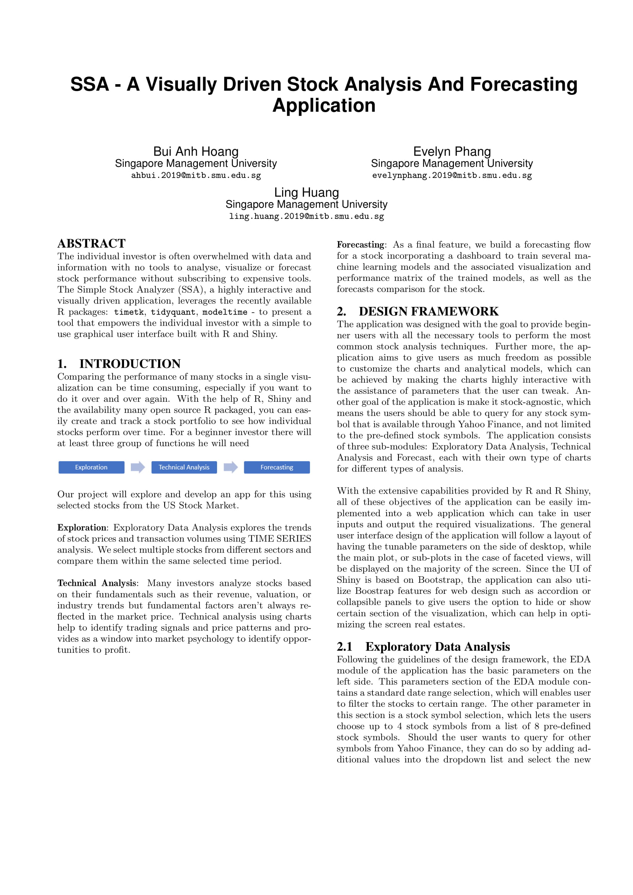
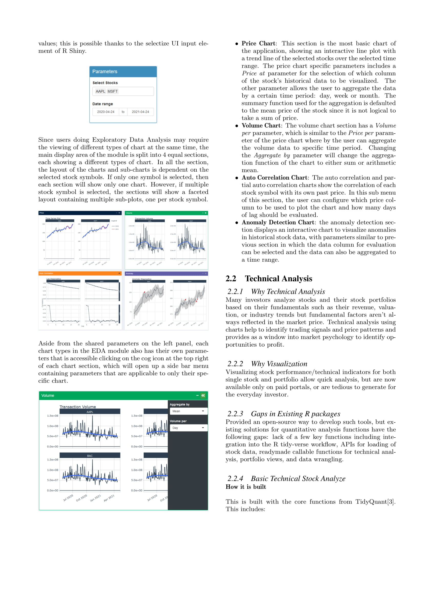
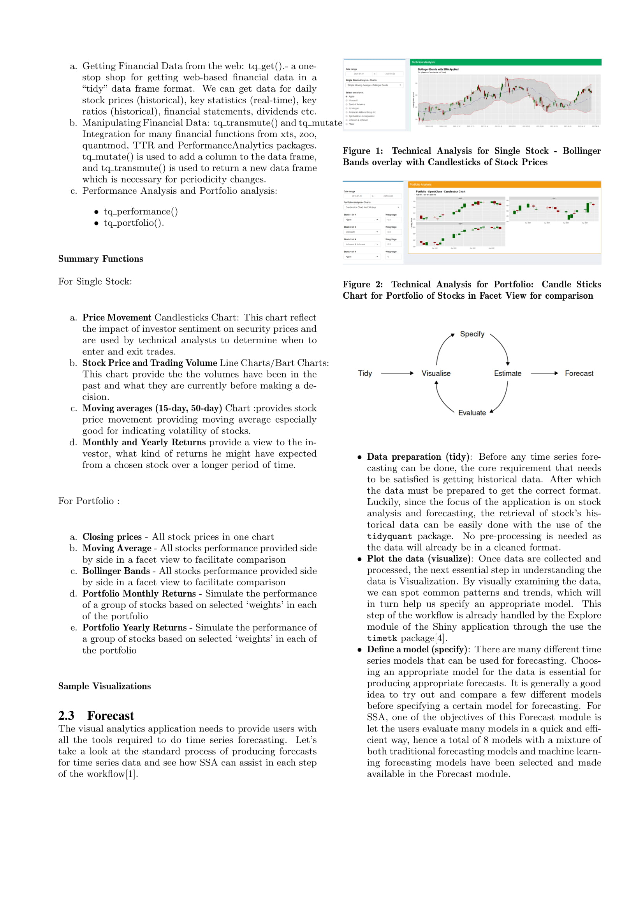

```{r setup, include=FALSE}
knitr::opts_chunk$set(echo = TRUE)
```

The project research paper can be downloaded [HERE](https://isss608stock.netlify.app/SSA-Research-Paper.pdf)

```{r, echo=FALSE, out.width="900px", fig.align="center"}

```

```{r, echo=FALSE, out.width="900px", fig.align="center"}

```

```{r, echo=FALSE, out.width="900px", fig.align="center"}

```

```{r, echo=FALSE, out.width="900px", fig.align="center"}
knitr::include_graphics("images/VAA-Research-Paper-4.jpg")
```

```{r, echo=FALSE, out.width="900px", fig.align="center"}
knitr::include_graphics("images/VAA-Research-Paper-5.jpg")
```

```{r, echo=FALSE, out.width="900px", fig.align="center"}
knitr::include_graphics("images/VAA-Research-Paper-6.jpg")
```